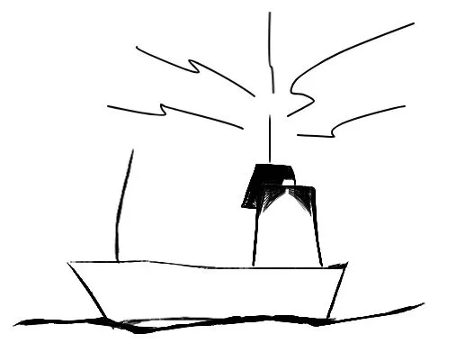
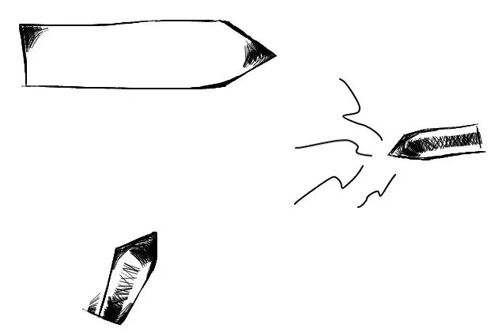
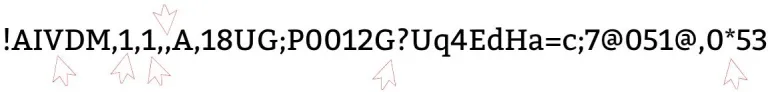

# What is AIS?
_(Posted {{page.date}})_

One of the domains, that I’ve done the most work in is the maritime domain. One of the interesting technologies here is AIS – Automatic Identification System. So – what is AIS?

Every ship larger than 300 BRT and all ships with paying passengers are required by international regulations to transmit “AIS messages” via radio in the VHF band periodically:

These messages can be thought of as small “SMS/text messages” and contain information about the ship’s name, draught, cargo, position, speed and a lot of other details.

Despite its name, AIS is not primarily intended for identification of ships – but to support anti-collision. Even very far out at sea. So AIS works without support from any land-based radio infrastructure.

The bandwidth in the VHF band is very limited – so AIS messages are very brief and sent in a compact format, to ensure that there is airtime for everyone – even in congested areas.

Now – we don’t have to be aboard a ship to receive AIS messages. The messages are not encrypted, so anyone with a VHF receiver can receive messages from ships in vicinity of the receiver. Typically a receiver can receive AIS messages from ships in a distance of up to 50 kilometers/30 nautical miles depending on weather and local conditions.

Examples of such receivers are dAISy (cheap, but very limited functionality) and Transas T-55. Other sources of AIS data are subscription services such as VT Explorer and MarineTraffic – or exhange based services such as AIShub.

Most receivers and others sources of AIS data will provide the AIS messages as “NMEA armoured messages”. These messages take a form like this:


!AIVDM,1,1,,A,18UG;P0012G?Uq4EdHa=c;7@051@,0*53


Don’t be scared – we’ll dissect it 🙂

As you can see, the NMEA message is constructed from a number of fields separated by commas:

!AIVDM is the NMEA message type. This tells us that this NMEA message contains AIS data received via AIS. Other possible values are defined in the NMEA 0183 specification.

* The first `1` tells us the number of NMEA messages which are used to transmit this AIS message. Sometimes it says `2` – but when there’s a `1` like in our example here, things are easy – and we need to consider only this single sentence.

* The second `1` tells us the sentence number. So this is NMEA message number 1 of 1.

* The blank field we’ll leave out for now.

* Then there’s an `A`. This tells us, that this AIS messages was received on AIS channel A. For most uses this is not of great importance.

* Then we have it: The important part – the payload, which looks like this: `18UG;P0012G?Uq4EdHa=c;7@051@`. This is the actual AIS message which was received via VHF  radio – here represented as a string in “6-bit ASCII” format. We could call it the “encoded AIS data”.

* `0*53` is an NMEA checksum to verify the integrity of this message.

In total, there are 27 different types of messages which can be sent via AIS. These are all defined in great detail in a technical publication by the International Telecommunications Union called “Recommendation ITU-R M.1371-5“. The example above is a type 1 message – or in plain word: A position report. For introductory purposes other messages types of interest are type 2-3 (other variants of position reports) and type 5 (static and voyage related data).

In this blog post I shall not go into detail with how to decode the payload. This process contains a lot of nitty gritty and ugly details. But I maintain a two Java-based open source libraries which are capable of decoding this message into plain old Java objects (POJO’s) so that you do not need to know all these details:

* [AISmessages](https://github.com/tbsalling/aismessages) which I have built from scratch and is used in production in several projects across the planet.

* [AISlib](https://github.com/dma-ais/AisLib) which was built by a client of mine and which I occasionally maintain.

I have deployed AISmessages as an online REST service in a number of different ways (which I will go into detail with in other posts). For instance AISmessages is available on a Heroku service and also an AWS Lambda function.

Pasting the AIS message above into the Heroku implementation on [ais.tbsalling.dk](https://ais.tbsalling.dk) reveals that `18UG;P0012G?Uq4EdHa=c;7@051@` can be translated into the following human-readable contents in JSON representation:


{
  "messageType":"PositionReportClassAScheduled",
  "navigationStatus":"UnderwayUsingEngine",
  "rateOfTurn":0,
  "speedOverGround":6.6,
  "positionAccuracy":false,
  "latitude":37.912167,
  "longitude":-122.42299,
  "courseOverGround":350.0,
  "trueHeading":355,
  "specialManeuverIndicator":"NotAvailable",
  "raimFlag":false,
  "communicationState":{
    "syncState":"UTCDirect",
    "slotTimeout":1,
    "numberOfReceivedStations":null,
    "slotNumber":null,
    "utcHour":8,
    "utcMinute":20,
    "slotOffset":null
  },
  "second":40,
  "repeatIndicator":0,
  "sourceMmsi":{
    "mmsi":576048000
  },
  "valid":true
}


# Important resources

If you're interested in AIS and software development I recommend you to stay tuned on this blog. Also I can highly recommend to study the following very important specifications, tutorials and views on AIS:

- All details in one document: [The AIS specification from ITU](http://www.itu.int/rec/R-REC-M.1371-5-201402-I).

- [AIVDM/AIVDO protocol decoding](https://gpsd.gitlab.io/gpsd/AIVDM.html) by Eric S. Raymond - a very, very useful introduction to parsing the NMEA messages and AIS payloads.

- [The Toils of AIS: A Case Study in Application Protocol Design And Analysis](http://vislab-ccom.unh.edu/~schwehr/papers/toils.txt) by Eric S. Raymond and Kurt Schwehr - I am not sure whether this is tragic or funny - but great credit goes to Eric and Kurt for writing down these observations.
