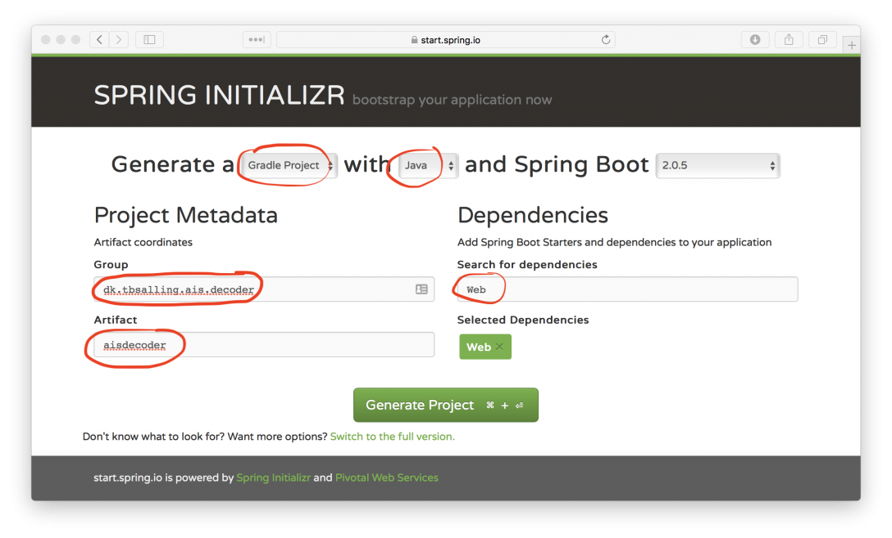

# Creating a Spring Boot based AIS message decoder
_(Posted {{page.date}})_

To demonstrate how easy it is to parse AIS messages (what is an AIS message?) with my open source library AISmessages, this post shows how to create a Spring Boot based microservice which can receive NMEA strings via HTTP and respond with the decoded AIS messages in JSON format.

So – for an HTTP request with a JSON array of NMEA strings like this:


POST http://localhost:8080/decode
Content-Type: application/json

[ 
  "!AIVDM,1,1,,A,18UG;P0012G?Uq4EdHa=c;7@051@,0*53",
  "!AIVDM,2,1,0,B,539S:k40000000c3G04PPh63<00000000080000o1PVG2uGD:00000000000,0*34"
  "!AIVDM,2,2,0,B,00000000000,2*27"
]


… we would like a response like this:


[
  {
    "repeatIndicator":0,
    "sourceMmsi": { "mmsi":576048000 },
    "navigationStatus":"UnderwayUsingEngine",
    "rateOfTurn":0,
    "speedOverGround":6.6,
    "positionAccuracy":false,
    "latitude":37.912167,
    "longitude":-122.42299,
    "courseOverGround":350.0
    "trueHeading":355,
    "second":40,
    "specialManeuverIndicator":"NotAvailable",
    "raimFlag":false,
    "communicationState": {
      "syncState":"UTCDirect",
      "slotTimeout":1,
      "numberOfReceivedStations":null,
      "slotNumber":null,
      "utcHour":8,
      "utcMinute":20,
      "slotOffset":null
    },
    "messageType":"PositionReportClassAScheduled",
    "transponderClass":"A",
    "valid":true
  }
]


# Initializing a new Spring Boot project

A quick way to build such a service is to use Spring MVC. So, first we need to initialize a new Spring Boot project. An easy way to do this is to visit https://start.spring.io and fill in the form like this:

 Generate and download the resulting project. Then move it to a suitable directory on your machine and unzip it like this:


$ mv ~/Downloads/aisdecoder.zip .
$ unzip aisdecoder.zip 
Archive:  aisdecoder.zip
   creating: aisdecoder/
  inflating: aisdecoder/gradlew      
   creating: aisdecoder/gradle/
   creating: aisdecoder/gradle/wrapper/
   creating: aisdecoder/src/
   creating: aisdecoder/src/main/
   creating: aisdecoder/src/main/java/
   creating: aisdecoder/src/main/java/dk/
   creating: aisdecoder/src/main/java/dk/tbsalling/
   creating: aisdecoder/src/main/java/dk/tbsalling/ais/
   creating: aisdecoder/src/main/java/dk/tbsalling/ais/decoder/
   creating: aisdecoder/src/main/java/dk/tbsalling/ais/decoder/aisdecoder/
   creating: aisdecoder/src/main/resources/
   creating: aisdecoder/src/main/resources/static/
   creating: aisdecoder/src/main/resources/templates/
   creating: aisdecoder/src/test/
   creating: aisdecoder/src/test/java/
   creating: aisdecoder/src/test/java/dk/
   creating: aisdecoder/src/test/java/dk/tbsalling/
   creating: aisdecoder/src/test/java/dk/tbsalling/ais/
   creating: aisdecoder/src/test/java/dk/tbsalling/ais/decoder/
   creating: aisdecoder/src/test/java/dk/tbsalling/ais/decoder/aisdecoder/
  inflating: aisdecoder/.gitignore   
  inflating: aisdecoder/build.gradle  
  inflating: aisdecoder/gradle/wrapper/gradle-wrapper.jar  
  inflating: aisdecoder/gradle/wrapper/gradle-wrapper.properties  
  inflating: aisdecoder/gradlew.bat  
  inflating: aisdecoder/settings.gradle  
  inflating: aisdecoder/src/main/java/dk/tbsalling/ais/decoder/aisdecoder/AisdecoderApplication.java  
  inflating: aisdecoder/src/main/resources/application.properties  
  inflating: aisdecoder/src/test/java/dk/tbsalling/ais/decoder/aisdecoder/AisdecoderApplicationTests.java 


As a smoke test we will first build new freshly, unmodified project - this is done with Gradle like this:


$ cd aisdecoder
$ ./gradlew build
... <a lot of build information>
BUILD SUCCESSFUL in 15s
5 actionable tasks: 5 executed


With the boiler plate project just built, we should see that it runs:


$ ./gradlew bootRun
> Task :bootRun
  .   ____          _            __ _ _
 /\\ / ___'_ __ _ _(_)_ __  __ _ \ \ \ \
( ( )\___ | '_ | '_| | '_ \/ _` | \ \ \ \
 \\/  ___)| |_)| | | | | || (_| |  ) ) ) )
  '  |____| .__|_| |_|_| |_\__, | / / / /
 =========|_|==============|___/=/_/_/_/
 :: Spring Boot ::        (v2.0.5.RELEASE)
... <a lot of log output omitted>
o.s.b.w.embedded.tomcat.TomcatWebServer  : Tomcat started on port(s): 8080 (http) with context path ''
2018-09-13 07:59:01.475  INFO 10989 --- [           main] d.t.a.d.a.AisdecoderApplication          : Started AisdecoderApplication in 1.7 seconds (JVM running for 2.008)
<=========----> 75% EXECUTING [21s]
> :bootRun


All seems well. The Spring MVC web application is running - but not doing much useful yet.

# Adding custom code

## Adding AISmessages as a dependency

The first thing we will do, is to add AISmessages as a dependency. This is done by adding this line into build.gradle:


...
dependencies {
  compile group: 'dk.tbsalling', name: 'aismessages', version: '2.2.3'   
  ...
}
...


## Adding Spring MVC Controller

Next we will add the Spring MVC controller which handle incoming HTTP requests. This controller should be able to receive a JSON array of NMEA strings and output a JSON array of AIS messages.

So, in folder `src/main/java/dk/tbsalling/ais/decoder/` we add file `AisdecoderController.java` like this:


package dk.tbsalling.ais.decoder.aisdecoder;

import dk.tbsalling.aismessages.ais.messages.AISMessage;
import org.springframework.http.MediaType;
import org.springframework.web.bind.annotation.RequestBody;
import org.springframework.web.bind.annotation.RequestMapping;
import org.springframework.web.bind.annotation.RequestMethod;
import org.springframework.web.bind.annotation.RestController;
import java.util.Collections;
import java.util.List;

@RestController
public class AisdecoderController {
    @RequestMapping(
        value = "/decode",
        method = RequestMethod.POST,
        consumes = MediaType.APPLICATION_JSON_VALUE,
        produces = MediaType.APPLICATION_JSON_VALUE
    )
    public List<AISMessage> decode(@RequestBody List<String> nmea) {
        return Collections.emptyList();
    }
}


This class is discovered by Spring through classpath scanning at startup, and handles incoming HTTP POST requests headed for URI /decode - such as http://localhost:8080/decode. The current implementation is mostly boiler plate and does nothing useful.

What we want it to do, is to call a service class which can convert the received NMEA strings into AIS messages. Like this:


@RestController
public class AisdecoderController {
    @Autowired
    private AisdecoderService aisdecoderService;
    ...
    public List<AISMessage> decode(@RequestBody List<String> nmea) {
        return aisdecoderService.decode(nmea);
    }
}


## Adding AIS decode service

Then we need need the `AisdecoderService`. This is the most custom part of the code and where the real work happens. It should receive a list of n NMEA messages, convert and return these as a list of m AIS messages.

We start by adding to `src/main/java/dk/tbsalling/ais/decoder/` the class `AisdecoderService.java`:


package dk.tbsalling.ais.decoder.aisdecoder;

import dk.tbsalling.aismessages.ais.messages.AISMessage;
import java.util.List;

@Service
@RequestScope
public class AisdecoderService {
    
    public List<AISMessage> decode(List<String> nmea) {
    }
    
}


So - how do we implement the decode method? The key here is class `NMEAMessageHandler` from AISmessages. `NMEAMessageHandler` is a class which can keep consuming NMEA messages and perform a callback whenever the received messages result in the successful decoding of a complete AIS message. Sometimes NMEA messages and AIS messages correspond 1:1 - other times it takes 2 NMEA messages to decode 1 AIS message.

So - we will extend AisdecoderService like this:


...
public class AisdecoderService implements Consumer<AISMessage> {
    
    public List<AISMessage> decode(List<String> nmeaMessagesAsStrings) {
        NMEAMessageHandler nmeaMessageHandler = new NMEAMessageHandler("SRC1", this);
    }
    
    @Override
    public void accept(AISMessage aisMessage) {
        aisMessages.add(aisMessage);
    }
}


Now the decode()-method initializes a `NMEAMessageHandler`. This handler is handed this (the decoder itself) to that it can make callbacks whenever an AIS message is fully constructed. To be used for callbacks, the `AisdecoderService` needs to implement the `Consumer<AISMessage>` interface.

Next, we need to start feeding the NMEA messages to the `NMEAMessageHandler`. One way to do that is this loop which iterates over all the NMEA strings and passes each one to the `NMEAMessageHandler`:


...
public class AisdecoderService implements Consumer<AISMessage> {
    ...
    public List<AISMessage> decode(List<String> nmeaMessagesAsStrings) {
       ...
        // Decode all received messages
        nmeaMessagesAsStrings.forEach(nmeaMessageAsString -> {
            try {
                NMEAMessage nmeaMessage = NMEAMessage.fromString(nmeaMessageAsString);
                nmeaMessageHandler.accept(nmeaMessage);
            } catch(NMEAParseException e) {
                System.err.printf(e.getMessage());
            }
        });
    }
    ...
}


Everytime the NMEA message handler can put the NMEA pieces together a complete AIS message, a callback is made to the `AisdecoderService#accept(AISMessage msg)` method. This method needs to store i AIS messages in a list, so that they can be returned by the decoder later:


public class AisdecoderService implements Consumer<AISMessage> {
    ...
    private final List<AISMessage> aisMessages = new LinkedList<>();
    @Override
    public void accept(AISMessage aisMessage) {
        aisMessages.add(aisMessage);
    }
    ...
}


Finally, in the `decode()` method, we must deal with the situation, where there are no more NMEA messages. This calls for a flush of the NMEAMessageHandler and return of the collected AIS messages:


...
public class AisdecoderService implements Consumer<AISMessage> {
    ...
    public List<AISMessage> decode(List<String> nmeaMessagesAsStrings) {
         ...
        // Flush receiver for unparsed message fragments
        List unparsedMessages = nmeaMessageHandler.flush();
        unparsedMessages.forEach(unparsedMessage -> {
            System.err.println("NMEA message not used: " + unparsedMessage);
        });
        // Return result
        return aisMessages;
    }
    ...
}


# Complete code

The complete code resulting from the above can be viewed on Github: https://github.com/tbsalling/aisdecoder/tree/ready/spring-boot-webservice

Run it yourself

The code can then be cloned, compiled, run and invoked like this:


$ git clone https://github.com/tbsalling/aisdecoder.git
Cloning into 'aisdecoder'...
remote: Counting objects: 32, done.
remote: Compressing objects: 100% (18/18), done.
remote: Total 32 (delta 0), reused 32 (delta 0), pack-reused 0
Unpacking objects: 100% (32/32), done.
$ cd aisdecoder/
$ git checkout 7c02cbcef2ff273ab157e41fa71b193ae3304a93
$ ./gradlew build
...
BUILD SUCCESSFUL in 5s
$ ./gradlew bootRun
> Task :bootRun
  .   ____          _            __ _ _
 /\\ / ___'_ __ _ _(_)_ __  __ _ \ \ \ \
( ( )\___ | '_ | '_| | '_ \/ _` | \ \ \ \
 \\/  ___)| |_)| | | | | || (_| |  ) ) ) )
  '  |____| .__|_| |_|_| |_\__, | / / / /
 =========|_|==============|___/=/_/_/_/
 :: Spring Boot ::        (v2.0.5.RELEASE)
...
<=========----> 75% EXECUTING [42s]
> :bootRun
Then, in a separate terminal window the web service can be invoked with e.g. Postman or curl (on Linux or MacOS), like this:

$ curl -X POST http://localhost:8080/decode -H 'Content-Type: application/json' -d '[ "!AIVDM,1,1,,A,18UG;P0012G?Uq4EdHa=c;7@051@,0*53" ]'
[{"nmeaMessages":[{"rawMessage":"!AIVDM,1,1,,A,18UG;P0012G?Uq4EdHa=c;7@051@,0*53","valid":true,"sequenceNumber":null,"numberOfFragments":1,"fragmentNumber":1,"radioChannelCode":"A","checksum":83,"messageType":"AIVDM","encodedPayload":"18UG;P0012G?Uq4EdHa=c;7@051@","fillBits":0}],"metadata":{"source":"SRC1","received":"2018-09-13T10:28:19.661343Z","decoderVersion":"2.2.2","category":"AIS"},"repeatIndicator":0,"sourceMmsi":{"mmsi":576048000},"navigationStatus":"UnderwayUsingEngine","rateOfTurn":0,"speedOverGround":6.6,"positionAccuracy":false,"latitude":37.912167,"longitude":-122.42299,"courseOverGround":350.0,"trueHeading":355,"second":40,"specialManeuverIndicator":"NotAvailable","raimFlag":false,"communicationState":{"syncState":"UTCDirect","slotTimeout":1,"numberOfReceivedStations":null,"slotNumber":null,"utcHour":8,"utcMinute":20,"slotOffset":null},"messageType":"PositionReportClassAScheduled","transponderClass":"A","valid":true}]


That's it 🙂
